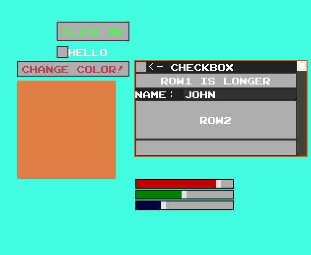

# Misty
A 2D graphics framework/game engine

Functional UI including buttons, checkboxes, scrollable tables, labels, textfields and variable sliders.

Includes basic socket based server/client functionality inlcuding handshake protocol to ensure client/server are aligned.

